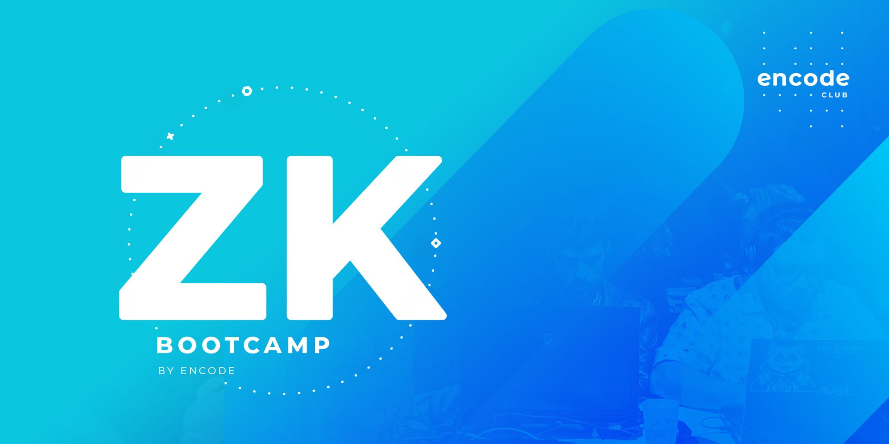

# ZK Bootcamp 2024 Q1

Encode Club - ZK Bootcamp 2024 Q1

> ###### [Hacker pack](https://encodeclub.notion.site/ZK-Bootcamp-Q1-2024-a9d42aad8f114a6b9b4cac4fdf128b25)
>
> ###### [Discord](https://discord.gg/encodeclub)
>
> ###### [Slido](https://app.sli.do/event/rkqwP9ciCE7QZQRop64jxX/live/questions)

## 

## [Extropy.io](https://www.linkedin.com/company/extropy-io-ltd/)

[**Laurence Kirk**](https://www.linkedin.com/in/extropylaurence/) _teacher_

[_Meek Msaki_](https://www.linkedin.com/in/msaki/) _assitant_

[_Fox Reymann_](https://www.linkedin.com/in/foxreymann/) _assitant_

## [Encode Club - ZK Bootcamp](https://www.encode.club/zk-bootcamp)

# Videos

Lecture weeks 🔳

First week ✔️

 
 > #### [Feb 19 - Overview / Maths & Cryptography Introduction](https://youtu.be/wMt5hwslFDg)
 >
 > #### [Feb 20 - ZKP Theory / Zokrates](https://youtu.be/HraLxOm3nA4)
 >
 > #### [Feb 21 - Use Cases of ZKPs / L2](https://youtu.be/lm2RyF-5GO8)
 >
 > #### [Feb 22 - Introduction to Starknet / Cairo](https://youtu.be/ioAkqbFzOGA)
 

Second week 🔳

> #### [Feb 26 - Starknet / Rust Continued](https://youtu.be/VUQ-zteaphk)
>
> #### [Feb 27 - DeFi / Aztec](https://youtu.be/6sYV7yOd0EA)
>
> #### [Feb 28 - Noir]() !!
>
> #### [Feb 29 - MINA]()

Third week 🔳

> #### [Mar 04 - MINA / zkApps]()
>
> #### [Mar 05 - zkEVM Solutions]()
>
> #### [Mar 05 - Risc Zero / Circom]()
>
> #### [Mar 07 - zkSNARKS Theory]()

Fourth week 🔳

> #### [Mar 11 - zkML / PLONK]()
>
> #### [Mar 12 - STARK Theory]()
>
> #### [Mar 13 - Cryptographic alternatives]()
>
> #### [Mar 14 - Research and review]()

Workshop week 🔳

18/03/2024 → 21/03/2024

Project week 🔳

25/03/2024 → 28/03/2024

---
### [HackMd - Answers](https://hackmd.io/@Extropy/Q124ZKPAnswers)
